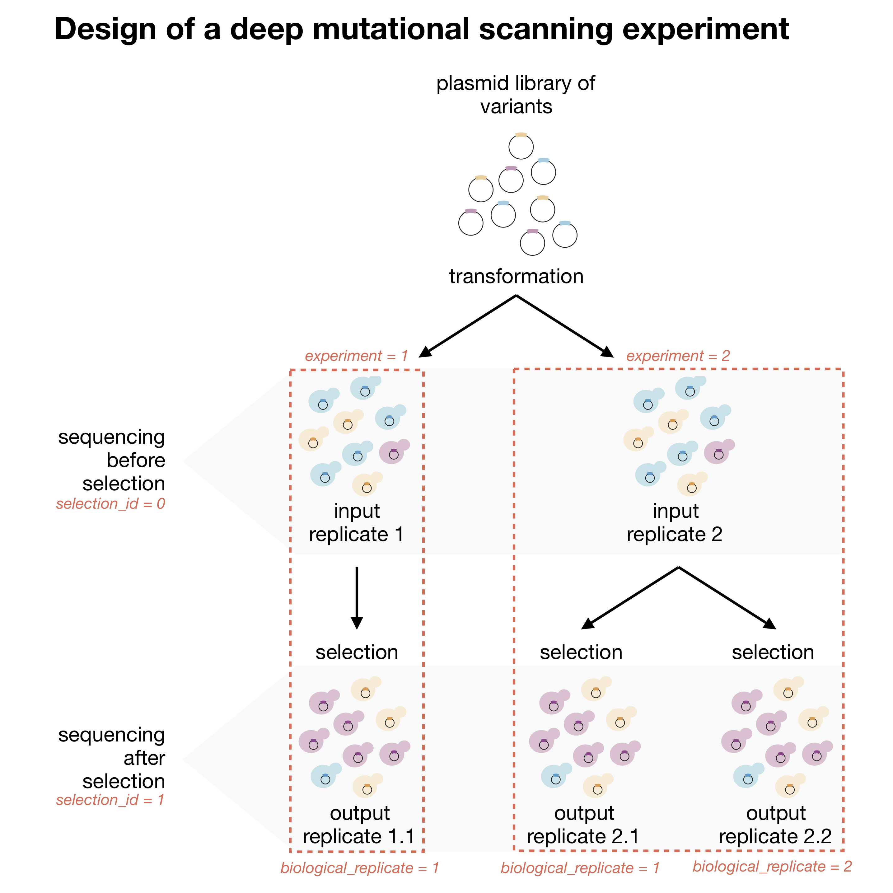

**[< Table Of Contents](https://github.com/lehner-lab/DiMSum#table-of-contents)**

  

# Input File Formats

## Experimental Design File 

**REQUIRED:** DiMSum requires a table (e.g. using Microsoft Excel) describing the experimental design that has been saved as tab-separated plain text file ('_--experimentDesignPath_'). You can download [this](../example_experimentDesign.txt) file to use as a template.

Your file must have the following columns:
* **sample_name** A sensible sample name e.g. 'input1' (alphanumeric characters only).
* **experiment_replicate** An integer identifier denoting distinct experiments (e.g. distinct plasmid library transformations) i.e. a set of input and output replicates originating from the same input biological replicate (strictly positive integer).
* **selection_id** An integer inidicating whether samples were sequenced before (0) or after (1) selection. Subsequent (serial) rounds of selection are indicated by higher numbers i.e. 2, 3, etc. (positive integer, zero included).
* **selection_replicate** An integer denoting distinct replicate selections (or biological output replicates) each derived from the same input sample (strictly positive integer). Entries should be blank (empty string) for all input samples (each input sample corresponds to a unique experiment).
* **technical_replicate** An integer denoting technical replicates (a strictly positive integer) corresponding to sample re-sequencing i.e. extracted DNA originating from the same sample split between separate sequencing lanes or files. Leave this column blank (empty string) when no technical replicates are present.
* **pair1** (_WRAP_ only) FASTQ file name of the first read in a given pair.
* **pair2** (_WRAP_ only) FASTQ file name of the second read in a given pair (omit for single-end library designs i.e. '_--paired_'=F).

Below is a schematic of a generic deep mutational scanning experiment indicating the corresponding entries which should be made in the experimental design file (red text). 

  

In addition to these mandatory columns, additional columns may be included to specify [Stage 2](https://github.com/lehner-lab/DiMSum#stage-2-trim-constant-regions-wrap)-specific options i.e. those prefixed by '_--cutadapt_', which relate to constant region trimming. This allows sample-specific trimming behaviour if necessary. Options specified by columns in the experimental design file override global arguments provided on the command-line. In the case of a growth-rate based assay, a 'generations' column can be supplied (for all output samples) in order to normalize fitness and error estimates accordingly.

## FASTQ Files

**OPTIONAL:** If processing of raw sequencing reads is required (with *WRAP*), DiMSum requires FASTQ formatted files saved in a common directory ('_--fastqFileDir_') and formatted consistently ('_--fastqFileExtension_', '_--gzipped_'). Either FASTQ Files or a [Variant Count File](#variant-count-file) can be supplied (not both).

## Variant Count File

**OPTIONAL:** If raw sequencing reads have already been processed independently of DiMSum, processing and analysis of variant counts (with DiMSum *STEAM*) requires a table (e.g. using Microsoft Excel) with variant sequences and counts for all samples ('_--countPath_'). You can download [this](../example_variantCounts.txt) file to use as a template. Either [FASTQ Files](#fastq-files) or a Variant Count File can be supplied (not both).

## Barcode Design File

**OPTIONAL:** If the raw FASTQ sequencing files contain multiplexed samples, DiMSum requires a table (e.g. using Microsoft Excel) describing how index tags map to samples that has been saved as tab-separated plain text file ('_--barcodeDesignPath_'). You can download [this](../example_barcodeDesign.txt) file to use as a template.

Your file must have the following columns:
* **pair1** FASTQ file name of the first read in a given pair.
* **pair2** FASTQ file name of the second read in a given pair (omit for single-end library designs i.e. '_--paired_'=F).
* **barcode** Sample index tag (A/C/G/T characters only).
* **new_pair_prefix** FASTQ file prefix of demultiplexed sample reads i.e. excluding file extension (alphanumeric and underscore characters only).

When including a barcode design file, ensure that all 'new_pair_prefix' column entries correspond to 'pair1' and 'pair2' column entries in the experiment design file by appending '1.fastq' and '2.fastq' to the prefix for the first and second read respectively.

## Variant Identity File

**OPTIONAL:** If the supplied sequences (supplied in the [FASTQ files](#) or [Variant count file](#)) contain variant barcodes, DiMSum requires a table (e.g. using Microsoft Excel) describing how barcodes map to variants that has been saved as tab-separated plain text file ('_--barcodeIdentityPath_'). You can download [this](../example_variantIdentity.txt) file to use as a template. 

Your file must have the following columns:
* **barcode** DNA barcode (A/C/G/T characters only).
* **variant** Associated DNA variant (A/C/G/T characters only).

